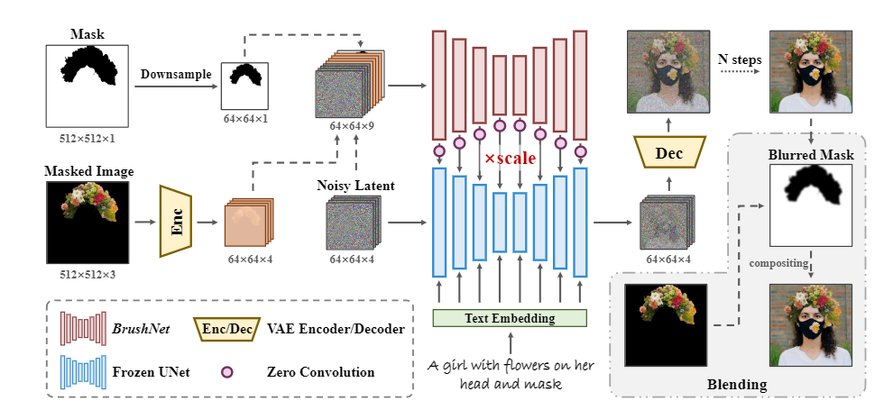

1. 对掩码进行下采样以适应潜在空间的大小,并将被掩码的图像输入到 VAE 编码器中以对齐潜在空间的分布。
2. 将噪声潜在向量、被掩码图像的潜在向量以及下采样后的掩码连接在一起作为 BrushNet 的输入。
3. 从 BrushNet 提取的特征在经过零卷积块[51]后,逐层添加到预训练的 UNet 中。在去噪之后,生成的图像和被掩码的图像通过模糊掩码进行混合。

这段描述解释了该模型的工作流程:

* 输入处理阶段:对掩码下采样,对图像进行 VAE 编码
* 特征提取阶段:使用 BrushNet 处理连接后的输入
* 特征融合阶段:与ControlNet保持一致
* 输出阶段:最终通过模糊掩码将生成图像和原图像混合
