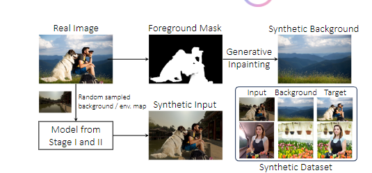
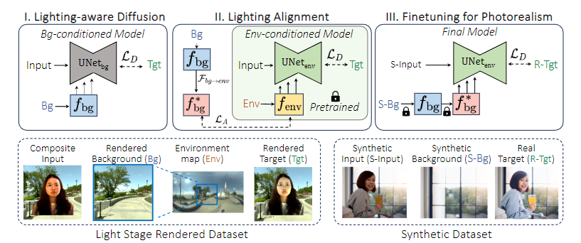

### 文献总结

from me: 前两个阶段的训练目标，是通过HDR环境贴图渲染的图像，区别是第一阶段通过背景，第二阶段通过环境map,目的是为了让通过背景的训练可以和通过环境map的特征对齐。
第三阶段：创建真实样本的训练对，进行精细化训练。

数据集：100unique light stage subjects,2908个HDR环境贴图，渲染出400k训练对

* 基础网络为InstructPix2Pix
  

#### 针对的问题：

这篇文献《Relightful Harmonization: Lighting-aware Portrait Background Replacement》针对的是肖像背景替换中的和谐化问题。在摄影和创意图像编辑中，将主体无缝地合成到新背景中，同时保持光线和颜色的一致性是一个挑战。现有的技术通常只关注调整前景的全局颜色和亮度，忽略了背景中的照明线索，如明显的光线方向，导致合成效果不真实。

#### 方法的创新点：

1\. 光照感知扩散模型：提出了一种新的光照感知扩散模型，能够利用任何背景图像为前景肖像无缝协调复杂的光照效果。

2\. \*\*三阶段训练流程\*\*：该方法通过三个阶段的训练流程，包括光照表示学习（将编码的光照信息注入到UNet骨干网络中）、光照特征对齐和真实感优化，以提高模型的性能（用第二阶段的模型作为数据增强器来生成训练数据）。

3\. \*\*数据合成管道\*\*：引入了一种新颖的数据合成管道，从自然图像中生成合成训练对，以提高模型在真实世界测试场景中的泛化能力。

4\. \*\*不依赖外部环境贴图\*\*：一旦训练完成，该流程不依赖任何外部环境贴图，为灵活的背景替换和肖像和谐化提供了强大的支持。

#### 相关工作：

其他方法的实现逻辑通常集中在颜色统计匹配上，通过调整前景的颜色色调、对比度和照明来匹配背景。然而，这些方法往往忽略了背景中的照明特征，如光线方向和阴影，这可能导致在背景具有独特照明条件时，合成图像看起来不自然。**此外，一些基于肖像重照明的方法需要在训练和推理期间使用高动态范围（HDR）全景环境贴图，这在普通摄影设置中不易获取。**

相比之下，**本文提出的方法不需要外部输入源，除了单个目标背景图像。此外，该方法不依赖于多阶段框架或外部软件包，简化了整个过程，减少了中间步骤可能引入的错误。**

#### 方法讲解：

- \*\*基于的网络\*\*：该方法基于预训练的扩散模型，使用了InstructPix2Pix作为基础架构。
- \*\*光照表示学习\*\*：通过一个光照表示学习模块，从目标图像背景中编码光照信息，并将其注入到UNet主干网络中。
- \*\*光照特征对齐\*\*：通过一个对齐网络，将从背景图像中提取的光照特征与从全景环境图中学习的特征对齐，以增强物理准确性。
- \*\*真实感优化\*\*：在第三阶段，使用从自然图像合成的高质量像素对齐训练对，通过冻结光照表示提取和条件分支，仅微调UNet主干网络，以提高合成质量。

#### 实验部分：

\- \*\*数据集来源\*\*：测试场景包括500个光舞台渲染的测试对、200个从真实图像合成的自然图像测试对，以及真实世界肖像与任意背景的组合。

\- \*\*数据处理方法\*\*：使用了一些数据增强技术，如旋转HDR贴图和使用不同的视场（FoV）来增加背景的多样性。

\- \*\*设备信息\*\*：模型在PyTorch框架下实现，使用8×80GB A100 GPU进行训练，分辨率为512×512，批量大小为96。

综上所述，这篇文献提出了一种创新的光照感知扩散模型，通过三阶段训练流程和数据合成管道，有效地解决了肖像背景替换中的和谐化问题，并在真实世界测试场景中展示了优越的泛化能力。

实施细节：

* 第一阶段和第二阶段 *
  在第一和第二阶段，我们总共使用了400k训练图像对，这些图像对是从100个唯一的光照阶段主题和2908个HDR环境贴图的任意组合中渲染出来的。我们还随机旋转HDR贴图，并使用不同的视场（FoV）来增加背景的多样性。

# 补充

## 引言

有两类主要的方法可以自动调整人像的前景以匹配背景：(1) 图像协调技术和 (2) 人像重光照方法。协调方法[5, 7, 8, 14–16, 23, 27, 30, 31, 57, 62, 68, 69]旨在通过调整前景的色调、对比度和光照来匹配前景与背景的颜色统计。然而，这些方法往往忽视了光照特性，保持前景光照效果不变，例如光照方向和阴影，这可能导致在背景光照条件明显不同的情况下出现不自然的效果。例如，将在顶光下拍摄的人物合成到日落场景中，可能会让合成图像在人眼中显得不真实。另一方面，最近的人像重光照工作[34, 39, 43, 56, 65, 70, 73, 77, 80]旨在**通过使用光照舞台系统[10]**获取的配对训练数据来匹配主体在新环境中的光照。
然而，当前的重光照方法通常在训练和推理过程中需要动态范围（HDR）全景环境贴图[43]，这在随意摄影环境中并不总是可行的。在这项工作中，我们探索了在简单的协调设置中生成真实且具有光照感知的合成图像的可能性。给定一个前景图像（及其对应的 alpha 蒙版）和任意背景图像，我们提出了一个统一的端到端框架，涵盖了颜色和光照协调。我们通过一个条件生成框架来处理这一任务，利用预训练的扩散模型[3, 8]，并开发了一个三阶段的训练流程。

在第一阶段，我们进行光照感知扩散训练，将显式光照条件整合到预训练的扩散模型中。这涉及一个光照表示学习模块，该模块从选定的背景图像中提取光照条件。然后，将得到的光照信息整合到扩散UNet主干中，以指导生成过程。训练在一个专门用于重光照的成对光照舞台数据集上进行，以有效捕捉光照动态。

鉴于从单一背景图像准确推断环境光照的挑战，这本质上是一个病态问题，我们使用配对的环境贴图来增强从背景中提取的光照表示的物理合理性。这是通过第二阶段的光照表示对齐实现的，旨在将从背景图像中提取的光照表示与从其对应的全景环境贴图中学习到的光照表示对齐。**HDR环境贴图怎么用于模型的训练**

最后，我们在扩展的数据集上进行逼真度微调，以提高协调的逼真度。我们提出了一种新颖的数据合成流程，使用我们最初训练的模型从自然图像中创建额外的数据。值得注意的是，一旦训练完成，我们的流程不依赖于任何外部环境贴图，这极大地增强了所提出框架在灵活背景替换和人像协调中的能力。

我们的贡献有三方面：(1) 我们通过在扩散主干中加入空间光照特征提取和条件模块，使光照效果能够在预训练的图像条件潜在扩散模型中被编码。背景提取的光照表示进一步与从全景环境贴图中提取的特征对齐，以确保更好的物理合理性。(2) 我们将模型用作数据增强器，并提出了一种新颖的数据模拟流程，从自然图像中合成训练对。然后使用扩展的数据集对模型进行优化，以进一步提升结果的逼真度。(3) 与现有的协调和重光照方法相比，我们的流程在光照一致性和视觉保真度方面展示了协调结果的改进，为各种设置中的真实世界人像协调提供了多功能的解决方案。

## 相关工作
人像重新照明：近期人像重新照明的进展主要由深度学习方法推动[34, 35, 39, 43, 45, 56, 65, 70, 73, 77, 80]。这些方法利用**光场舞台系统[10]获取的成对训练数据进行监督学习**。它们需要目标HDR环境图作为外部输入源，通常涉及中间预测表面法线、反照率和/或一组具有真实监督的漫反射和镜面反射图。然而，在背景替换和协调任务中依赖HDR图显著限制了它们在日常场景中的适用性，因为在这些场景中无法轻易捕获HDR图[43]。在我们的框架中，除了单一目标背景图像外，我们不需要任何外部输入源。
此外，许多当前的重新照明系统采用多阶段框架和/或严重依赖外部包[12]。因此，这些系统的准确性和性能取决于每个单独阶段的精度，使整个过程变得复杂，并容易受到通过这些中间步骤传播的错误影响。
另外，通常用于训练的数据集是从有限的光场舞台照明采集中渲染的，这意味着训练阶段使用的目标图像不是在真实世界条件下捕获的，而是渲染的合成图像。因此，它在未见过的图像上的泛化能力，以及应用于任意背景替换任务时的真实感仍不清楚。

预训练的文本到图像扩散模型[40, 48, 50]的应用已扩展到图像编辑任务[1–4, 9, 13, 17, 18, 22, 36–38, 54, 55, 59, 61, 66, 78]。这些模型利用文本-图像相关性在图像编辑中执行上下文修改，例如使用 InstructPix2Pix [3]“添加日落”，这与我们的光照感知设置有一定的联系。然而，基于文本的编辑不包含空间信息，因此缺乏对模型的细粒度控制。相反，我们建议使用空间光照表示作为新的“指令”，引导扩散模型执行光照感知编辑。

## 方法

### 训练

我们的光照感知扩散模型在给定合成输入的情况下，学习生成一个协调的图像，该图像以从目标背景图像中提取的光照表示为条件。遵循训练重光照模型的既定实践[43, 56, 76]，我们假设可以访问光照舞台渲染的训练数据集。一个训练元组包括输入图像（及其 alpha 蒙版）、目标背景、目标环境贴图以及目标图像。训练数据的示例如图2左下角所示。

* 43：
* 56：数据处理：有了OLAT图像集和环境照明，我们现在可以生成仅在照明方面不同的成对人像图像。我们的OLAT图像分辨率为2400×1800。对于每张图像，我们首先使用人体分割算法[Wadhwa et al. 2018]来遮蔽背景。然后我们从OLAT图像集中随机裁剪，裁剪位置均匀随机选择，裁剪大小从[512, 1024]中均匀随机选择。接着，我们随机选择两个环境照明（以经纬度格式表示），并对每个照明在经度上应用[0°, 360°]范围内的随机旋转（但不在纬度上旋转）。
然后将每个环境照明调整大小为128×256，此时将其投影到光场舞台LED定义的基底上。通过根据这些LED基底投影对OLAT图像集中的图像进行加权组合，我们能够在两种照明条件下渲染裁剪后的OLAT图像集。渲染后，这些照明再映射回16×32大小的经纬度格式。这是通过将每个LED建模为高斯光源（其中平均位置μ是每个LED在相机坐标中的位置，标准差σ=8°）然后投影到这些高斯分布的PDF定义的基底上来完成的。
最后，渲染的人像对被下采样到256×256，每张图像（及其对应的环境照明）被缩放，使得每张图像中的最大像素强度为1。所有处理都在线性域中进行，没有伽马校正。总共，我们生成了226,800对人像作为训练数据。请注意，训练和验证的被摄体或环境照明之间没有重叠——训练照明只与训练OLAT图像集配对，验证照明只与验证OLAT图像集配对。

形式上，我们将渲染的图像样本表示为 $x_{ai}$，表****示在光照条件 \(a\) 下照亮的主体 \(i\) 的人像图像。相应的环境贴图表示为 \($z_{ai}$\)，而 \($x_{ai}$\) 的背景图像 \($y_{ai}$\) 是通过以指定的视场和分辨率投影 HDR 图生成的。主体蒙版 \($m_i$\) 使用[71, 72]中描述的方法获得。

光照条件：我们进一步修改了扩散主干以整合显式光照条件。如图2-I所示，在 UNet 主干之上集成了一个光照条件分支，在 UNet 的多个尺度上注入由 CNN \(F\) 从目标背景图像编码的光照表示 \(f\)。条件机制的设计类似于[74]，其中条件特征图被添加到编码器内相应分辨率的 UNet 特征中。

利用光照舞台数据集，我们假设光照表示 \($f$\) 可以从成对训练中学习。具体来说，从同一主体 \(i\) 中采样一个训练元组为 \(($x_a （环境贴图）, m （mask）, y_b, x_b$)\)。噪声逐步添加到目标图像 \($x_b$\) 直到时间步 \(t\)，生成一个噪声图像 \(x_{bt}\)。UNet，记为 \($U_{bg}$\)，以从背景提取的光照特征 F_{bg}(y_b)\) 为条件进行训练，以预测噪声 \($\varepsilon$\)，其目标如下：

# 实验
## 设置与基准
4.1. 设置和评估指标
我们创建了三种测试场景进行评估：
(1) 500对光场舞台渲染的测试图像对，用于评估照明的准确性；
(2) 200对自然图像测试对，使用我们的数据合成流程从真实图像合成而成，用于评估照明的真实性；
(3) 最重要的是，将真实世界的人像与任意背景结合，以检验模型在实际场景中的泛化能力和适应性。
对于场景(1)和(2)，我们还使用常见的指标MSE、SSIM、PSNR和LPIPS [75]来量化结果。
为了进行基准比较，我们将Relightful Harmonization与established的协调方法INR [5]、PCT [14]、Harmonizer [27]和PIH [62]，以及重新照明方法TR [43]进行了比较。我们还构建了一个基于transformer架构的重新照明基线，并使用光场舞台数据对其进行了训练。更多细节在附录中提供。
需要注意的是，重新照明方法仅应用于光场舞台测试集，因为它们在没有HDR图的情况下不适用。

## 4.2. 实现细节
我们的模型使用PyTorch [44]实现，在8×80GB A100上以512×512分辨率运行，批量大小为96。在第一阶段，我们使用InstructPix2Pix [3]的预训练权重初始化UNet。在第一和第二阶段，我们总共使用了40万对训练图像对，这些图像对是从100个独特的光场舞台被摄体和2908个HDR环境图的任意组合中渲染而成。我们还随机旋转HDR图并使用不同的视场角来增加背景的多样性。在第三阶段，我们使用额外的20万对从自然图像合成的图像对来训练网络。我们将学习率设置为5e-5。更多细节在附录中提供。